Task Daddy - Task Management To-do List
=======================================

Task Daddy is a task management to-do list application designed to streamline your team's workflow and enhance productivity.

Features
--------

*   **Minimize Meeting Duration Times**: Ensure efficient use of time by minimizing the need for lengthy meetings.
*   **Ongoing Tracking of Task Progress and Deadlines**: Keep track of task progress and deadlines in real-time.
*   **Ensuring Adherence to Company Standards and Rules**: Maintain consistency and quality by ensuring adherence to company standards.
*   **Priority Task Display**: Display priority tasks on the dashboard.
*   **Task Navigation**: Quick access to various task-related pages from the dashboard.
*   **Task Creation**: Ability to create new tasks with details such as date, task name, priority, description, team members, and estimated date of completion.

About Task Daddy
----------------

Task Daddy is the ultimate task management to-do list app in 2024. It's designed to streamline your workflow and enhance team productivity. With Task Daddy, you can effortlessly monitor and track the progress of every task, ensuring a smooth and efficient completion process. By standardizing tasks and facilitating the flow of information, Task Daddy helps your team adopt best practices and achieve optimal results. Our centralized platform offers checklists, task libraries, and status updates, serving as the definitive resource for managing your projects. Say goodbye to confusion and wasted time — Task Daddy ensures that everyone on your team understands their responsibilities, boosting morale and eliminating the need for tedious meetings. With built-in separation of duties and robust internal controls, you can confidently assign and manage tasks, preventing bottlenecks and ensuring seamless collaboration. And when integrated with other tools in the Task Daddy suite, automation and system-prepared tasks simplify your workflow, making task management a breeze. Say hello to efficiency and success with Task Daddy.

Installation
------------

No installation required. Task Daddy is a web-based application accessible through any modern web browser.

Usage
-----

1.  Open Task Daddy in your web browser.
2.  Navigate to the task creation page to create new tasks with details such as date, task name, priority, description, team members, and estimated date of completion.

Registration
------------

To sign up for Task Daddy and start managing your tasks efficiently, follow these steps:

1. Visit the [registration page](link-to-your-registration-page) to create your account.
2. Fill out the registration form with your full name, email, phone number, and password.
3. Review the terms and conditions, and if you agree, proceed with the registration.
4. Once registered, you can log in to Task Daddy using your credentials and start managing your tasks.

Contact Information
-------------------

*   **Email**: info@taskdaddy.com
*   **Phone**: +1 234 567 8901
*   **Address**: 123 Task Daddy Way, New York, NY 10001

**Below are screen shots of different areas of the website as well as our wireframes/prototypes**

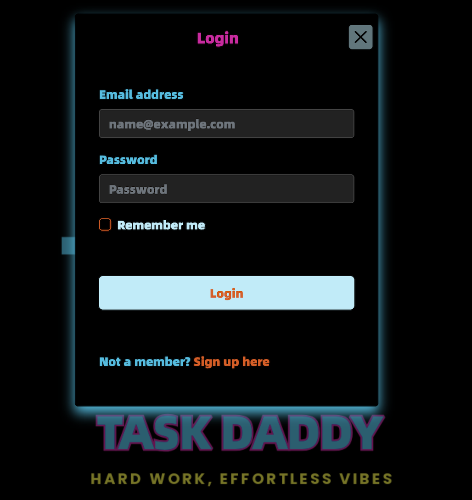
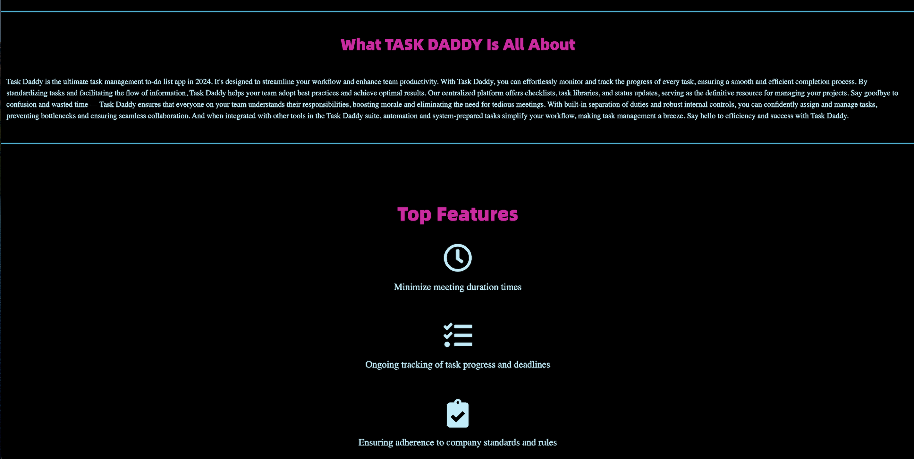

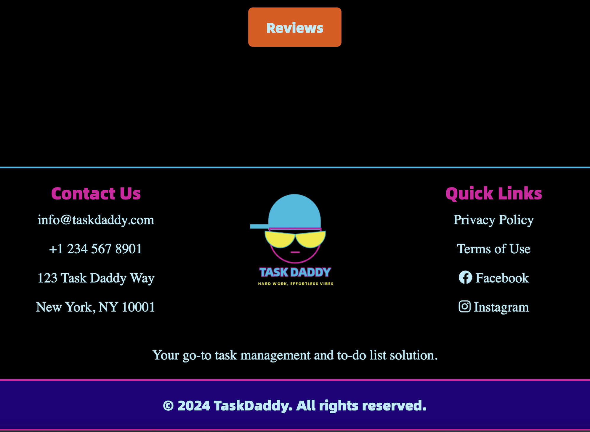

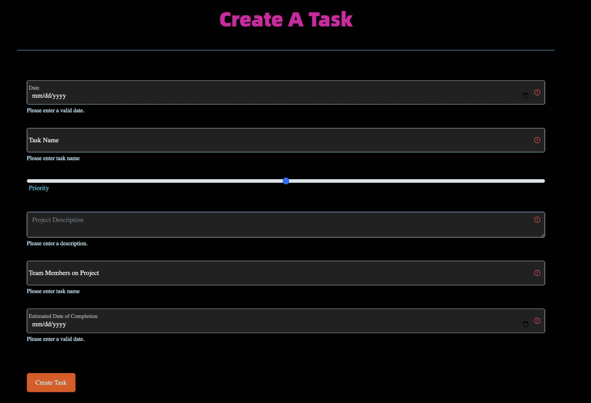
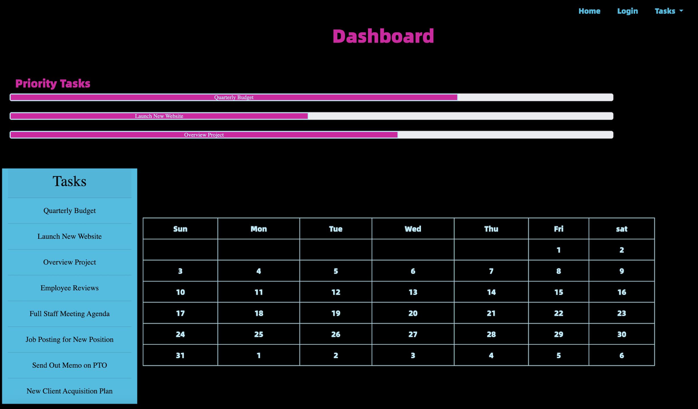
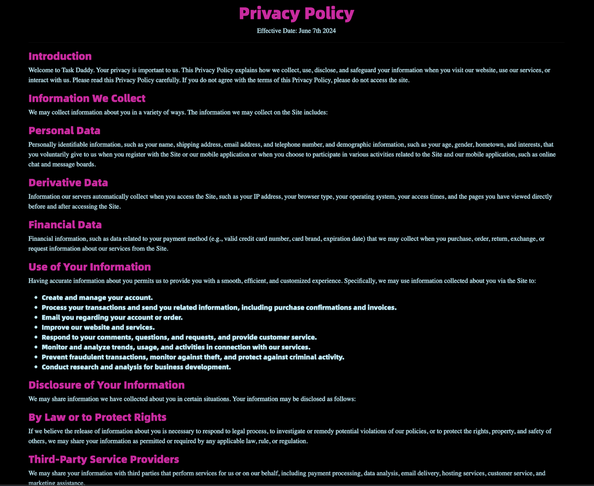

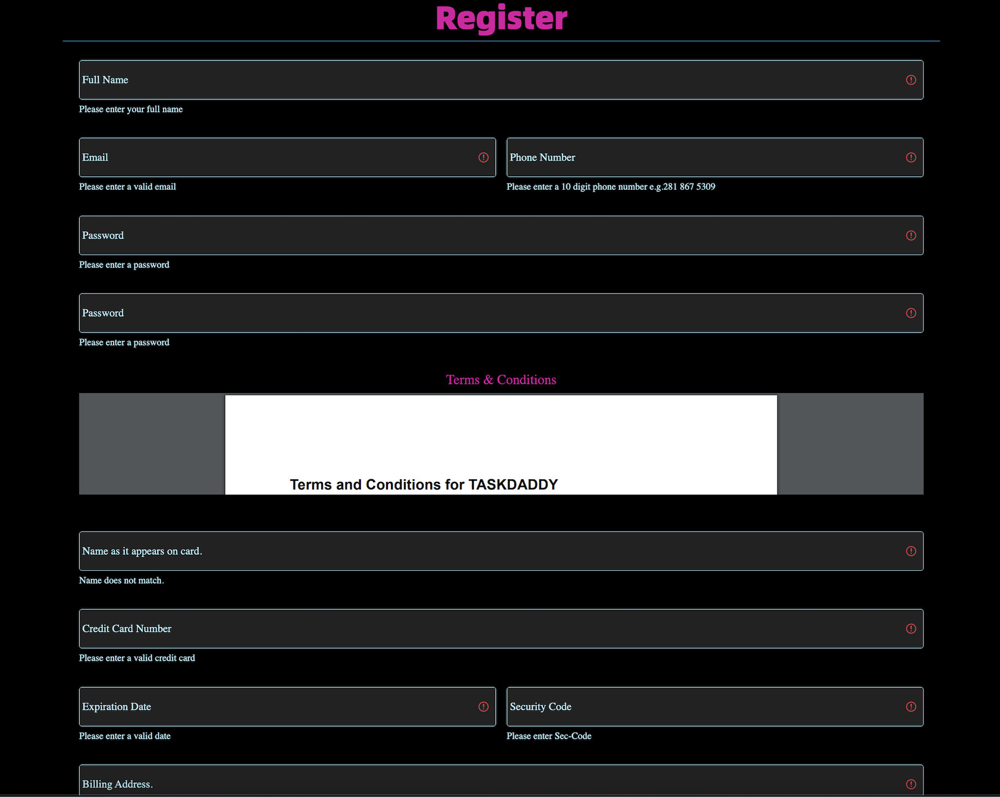
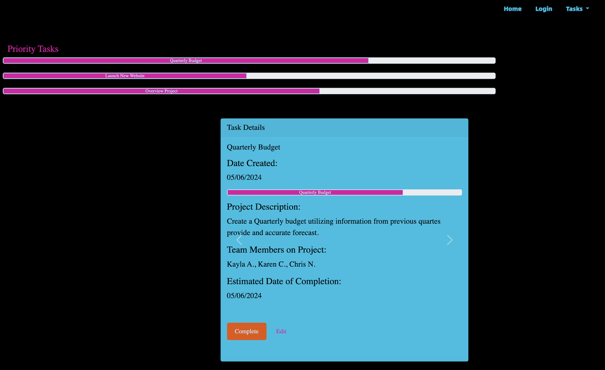
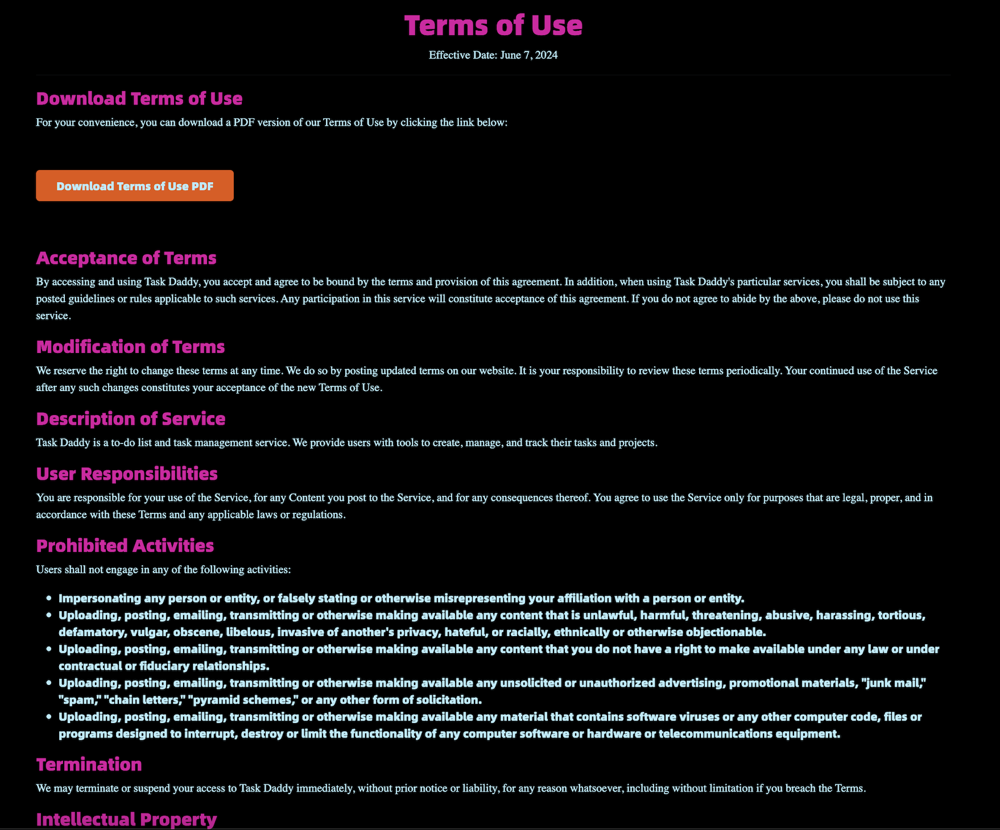

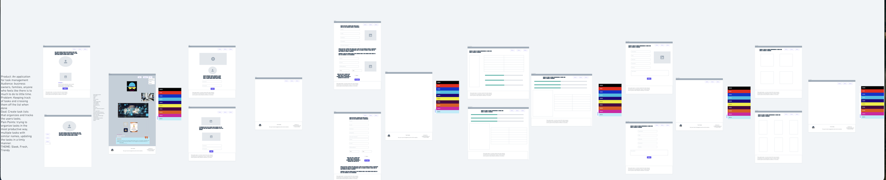
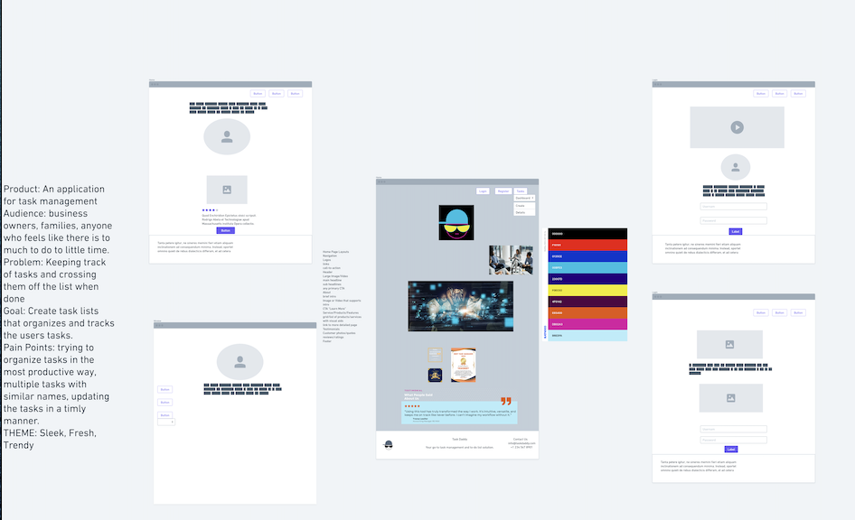